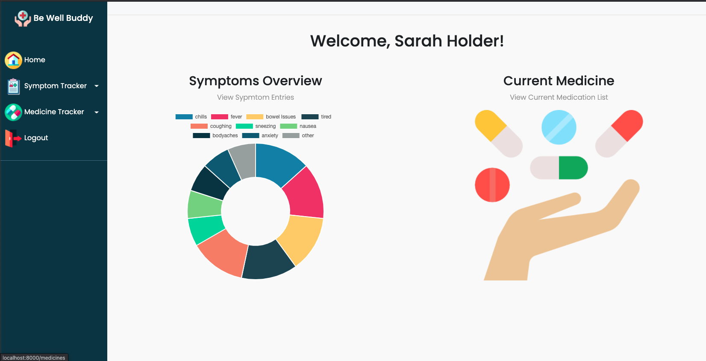

# Be Well Buddy 

Be Well Buddy is designed to allow users to track and record symptoms of illness and list of current medications and previous or archived medication.

In the hustle and bustle of our fast paced life it is easy to forget details over time. This app will allow a user to compile notes in one easy to use app.  A user can quickly navigate through the add new symptom entry, update a previous entered symptom entry, view symptom entry details, and view entries sorted in date order. They can also track current medication and past medication in the archive feature when the medicine end date has passed by.

This is a powerful resource and tool to use when talking with your healthcare provider and being able to reference the symptom entries or provide staff with current medication information easy with the list view.

Allows users to take control over their well-being and work towards a better body through tracking and awareness.

## Steps to get your project started

* Clone down the repo and `cd` into it

* Create your OSX/Linux OS virtual environment in Terminal:

  * `python -m venv bewellbuddyenv`
  * `source ./bewellbuddyenv/bin/activate`

* Install the app's dependencies:

  * `pip install -r requirements.txt`

* Build your database from the existing models:

  * `python manage.py makemigrations app`
  * `python manage.py migrate`

* Create a superuser for your local version of the app:

  * `python manage.py createsuperuser`

* Populate your database with initial data from fixtures files: (_NOTE: The order you add these fixtures is important_)

  * `python manage.py loaddata medications`
  * `python manage.py loaddata entries`
  * `python manage.py loaddata symptomEntry`
  * `python manage.py loaddata symptoms`
  * `python manage.py loaddata users`

* Start your dev server!

  * `python manage.py runserver`
  